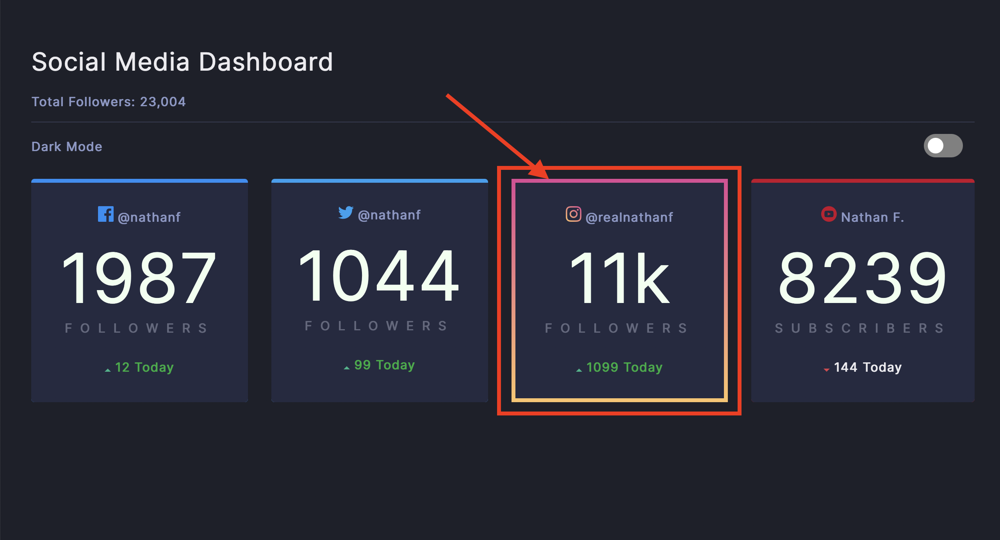
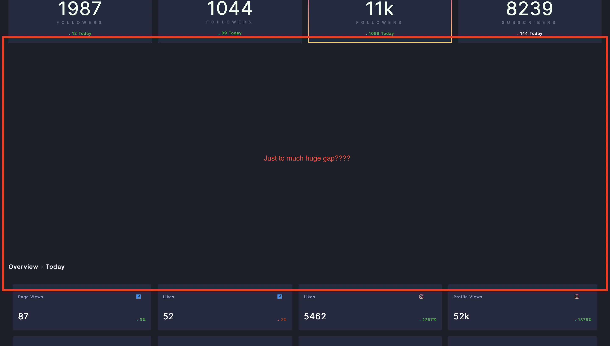

# Frontend Mentor - Social media dashboard with theme switcher solution

This is a solution to the [Social media dashboard with theme switcher challenge on Frontend Mentor](https://www.frontendmentor.io/challenges/social-media-dashboard-with-theme-switcher-6oY8ozp_H). Frontend Mentor challenges help you improve your coding skills by building realistic projects. 

## Table of contents

- [Overview](#overview)
  - [The challenge](#the-challenge)
  - [Screenshot](#screenshot)
  - [Links](#links)
- [My process](#my-process)
  - [Built with](#built-with)
  - [What I learned](#what-i-learned)
  - [Continued development](#continued-development)
  - [Useful resources](#useful-resources)
- [Author](#author)
- [Acknowledgments](#acknowledgments)

**Note: Delete this note and update the table of contents based on what sections you keep.**

## Overview

### The challenge

Users should be able to:

- Couldn't figure out how to do gradient for border-top for the instagram stats (both mobile and desktop) as shown in the image below. 

### Screenshot 1




- Desktop view: There is a huge gap between the "stats div" and the "daily stats div" as shown in screenshot below.
### Screenshot 2




### Links

- Solution URL: [Solution on Github here>>](https://github.com/ddoyediran/social-media-stats)
- Live Site URL: [Live site here>>](https://social-media-stats.vercel.app)

## My process

### Built with
- Semantic HTML5 markup
- CSS custom properties
- CSS Grid
- Mobile-first workflow


### What I learned
This really forced me to improve my HTML, CSS and JS knowledge:
## HTML
a. How to group elements that belongs to a same parent together to give them same style if they share same style and futher give them specific style when necessary.

## CSS
a. How to do mobile first design using css "@Media screen to define the size of the screen" and same applies to other device(s) sizes.

Example: 

```css 
/* Mobile style */
@media screen and (min-width: 375px) {

}

```

b. How to use "grid - display" to do layout in CSS - very important thing to know in css. 

Example: 

```css 
/* Grid */
.main-comp{
        display: grid; 
        grid-template-rows: repeat(3, auto); 
}

/* The CSS style takes a class of main-comp that has 3 divs or 3 elements and breaks them to a 3 horizontal layout or divided it into 3 seperate rows on the screen with auto size of the screen.   */
```


### Continued development
- Understand more about CSS
- Convert this to React.


## Author

- Website - [Damilare Oyediran](https://www.your-site.com)
- Github - [@ddoyediran](https://github.com/ddoyediran)
- Fork on Github - [@Github](https://github.com/ddoyediran/social-media-stats)
- View solution - (https://social-media-stats.vercel.app)


## Acknowledgments

This is where you can give a hat tip to anyone who helped you out on this project. Perhaps you worked in a team or got some inspiration from someone else's solution. This is the perfect place to give them some credit.

